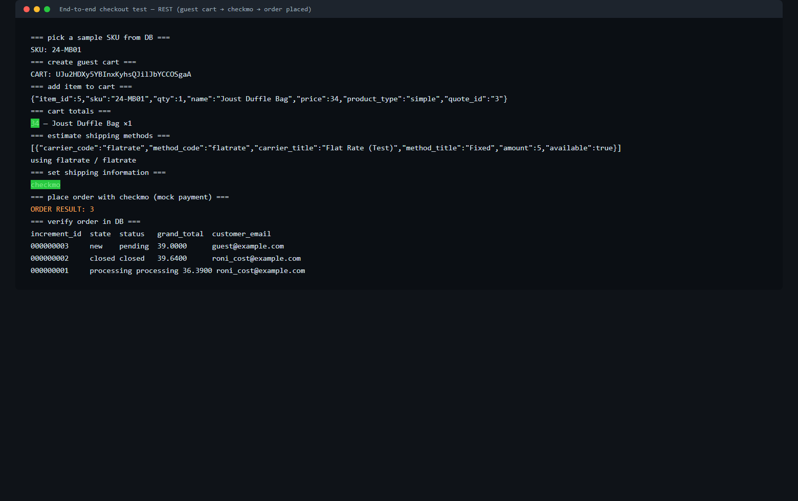
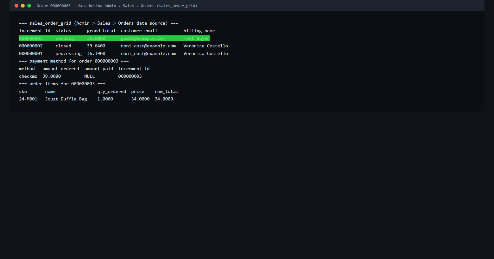
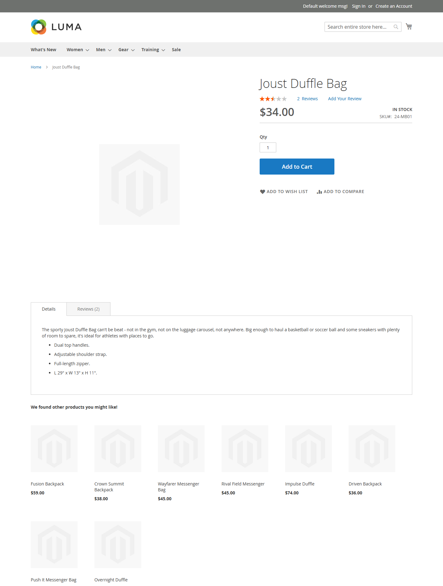
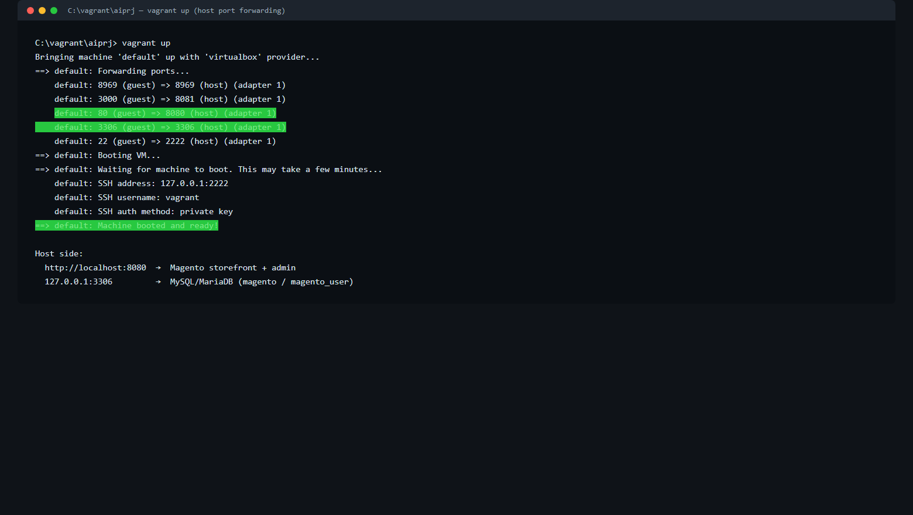
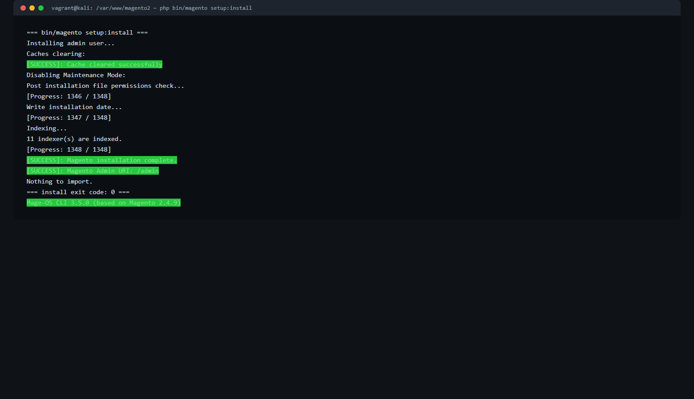
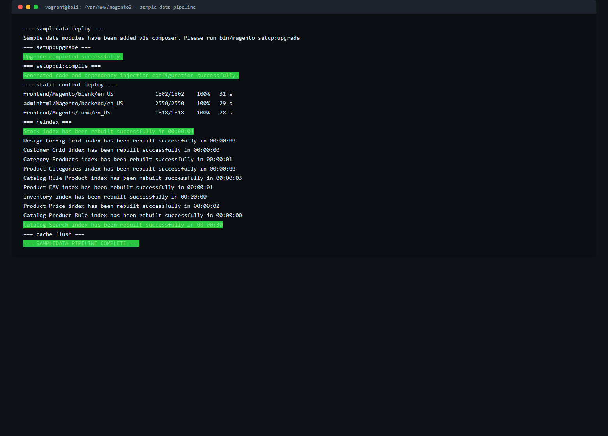
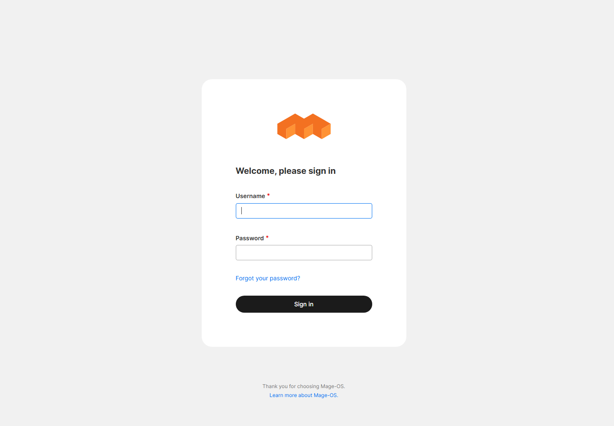

# Magento 2.4.9 Test Store on Vagrant (Kali Linux)


A complete, reproducible **local Magento 2 test store**: provisioned inside a **Kali Linux Vagrant VM** with **Apache, MariaDB 11.8 and Elasticsearch 8.19**, loaded with **2,000+ sample products**, and configured with a **mock payment method** (Check / Money Order) so orders can be placed end-to-end without any real payment processing. Everything is scripted — no manual browser-install steps.

> Base: **Mage-OS 3.5.0** — a drop-in, community distribution of **Magento Open Source**, based on **Magento 2.4.9** — installed with Composer from the key-free `repo.mage-os.org` mirror (repo.magento.com requires paid-marketplace auth keys, see [Troubleshooting](#troubleshooting--real-errors-hit-and-fixed)).

## What you get

| Component | Version / detail |
|---|---|
| Guest OS | Kali GNU/Linux Rolling (`kalilinux/rolling` 2026.2.0 box, VirtualBox) |
| Magento | Mage-OS 3.5.0 (Magento 2.4.9 base), `/var/www/magento2` |
| PHP | 8.4.24 + bcmath, curl, gd, intl, mbstring, mysqli/pdo_mysql, soap, xml/xsl, zip, opcache |
| Database | MariaDB 11.8.6 (MySQL drop-in), database `magento`, user `magento_user` |
| Search | Elasticsearch 8.19.22 — single node, security disabled, 512 MB heap |
| Web server | Apache 2.4.68 + mod_php, vhost rooted at `magento2/pub` |
| Composer | 2.10.3 |
| Sample data | 2,040 products, 40 categories, sample customers & orders |

## Access

| What | Where | Credentials |
|---|---|---|
| Storefront | http://localhost:8080 | — |
| Admin | http://localhost:8080/admin | `admin` / `***` (test-only) |
| MySQL from host | `127.0.0.1:3306` | `magento` / `magento_user` / `magento_password` |

> ⚠️ These are **localhost test credentials only** — never reuse them anywhere real.

## Architecture

```
Windows / Linux / macOS host
  └─ VirtualBox VM (Kali rolling, 4 GB RAM, 4 vCPU)
       ├─ Apache 2.4  :80   ── host forward ──►  http://localhost:8080
       ├─ MariaDB     :3306 ── host forward ──►  127.0.0.1:3306
       ├─ Elasticsearch :9200 (guest-only loopback)
       └─ /var/www/magento2  (Mage-OS 3.5.0 / Magento 2.4.9 base)
```

## Repository layout

```
magento2-vagrant-test-store/
├── README.md                  ← you are here
├── vagrant/
│   ├── Vagrantfile            ← minimal Magento-only config (ports 8080/3306)
│   └── Vagrantfile.aiprj-original ← the full Vagrantfile from the dev box
├── scripts/                   ← numbered, idempotent-ish runbook (see below)
├── screenshots/               ← real screenshots from the POC run
└── blog/medium-blog-draft.md  ← ready-to-publish Medium article
```

## Prerequisites

- VirtualBox 7.x and Vagrant 2.4+
- ~4 GB RAM for the VM and ~10 GB free disk
- Internet access (apt + Composer downloads; the Magento packages come from `repo.mage-os.org`)

## Quick start

```bash
cd magento2-vagrant-test-store/vagrant
vagrant up                       # boots Kali + forwards 8080/3306
vagrant ssh

# inside the VM, run the scripts in order (they live in /vagrant/...):
bash /vagrant/magento2-vagrant-test-store/scripts/01-db.sh
bash /vagrant/magento2-vagrant-test-store/scripts/02-elasticsearch.sh
bash /vagrant/magento2-vagrant-test-store/scripts/03-apache.sh        # after step 4a
bash /vagrant/magento2-vagrant-test-store/scripts/04a-magento-create.sh
bash /vagrant/magento2-vagrant-test-store/scripts/05-install.sh
bash /vagrant/magento2-vagrant-test-store/scripts/05b-sampledata.sh
bash /vagrant/magento2-vagrant-test-store/scripts/06-perms-payment.sh
```

> The scripts assume the Magento project lives at `/var/www/magento2` and are written for the POC run (paths are set at the top of each file). They are *mostly* idempotent; `04a` and `05` expect a clean slate.

## The runbook (what each script does)

| Script | Purpose |
|---|---|
| `00-check.sh` | Environment baseline: PHP modules, service states, listening ports |
| `01-db.sh` | Enable MariaDB, bind `0.0.0.0`, create DB `magento` + `magento_user` |
| `02-elasticsearch.sh` | Add Elastic 8.x apt repo, install ES, configure single-node/no-security/512 MB heap, wait for :9200 |
| `02b-fix-es.sh` | Repair ES config when 8.x security auto-configuration leaves broken YAML (see Troubleshooting #4) |
| `02c-fix-es-keystore.sh` | Remove stale `xpack.security.*.secure_password` keystore entries that block startup (Troubleshooting #5) |
| `03-apache.sh` | Enable `rewrite`/`headers`, Magento vhost with `DocumentRoot .../pub`, `AllowOverride All` |
| `04a-magento-create.sh` | `composer create-project` from `repo.mage-os.org` (Mage-OS 3.5.0) |
| `05-install.sh` | `bin/magento setup:install` — DB, admin user, `en_US`/USD/UTC, Elasticsearch 8 |
| `05b-sampledata.sh` | `sampledata:deploy` → `setup:upgrade` → `di:compile` → `static-content:deploy` → `indexer:reindex` → `cache:flush` |
| `06-perms-payment.sh` | Owner/group + recursive ACLs for `www-data`, cron install, enable Check/Money Order + Flat Rate |
| `07-verify-http.sh` | HTTP smoke tests (storefront, admin, headers) |
| `08-checkout-rest.sh` | **Full guest checkout via REST**: create cart → add SKU → shipping → checkmo → place order → verify in DB |
| `09-fix-perms2.sh` | Leaner permissions pass (ACLs only) — safe to re-run after installs |
| `10-verify-more.sh` | Deeper checks: page titles, admin redirect, ES cluster health, sample-data counts |
| `11-admin-verify.sh` | Prove the order is visible to Admin (grid source `sales_order_grid`, payment, items) |
| `12-probe.sh` | Small diagnostic helper used while debugging |
| `13-grid-twfa.sh` | Order data + disable `Magento_TwoFactorAuth` for headless test logins |
| `14-final-check.sh` | Final health check (2FA state, pages, services, ES health) |
| `15-excerpts.sh` | Collect install/pipeline log excerpts (used for the screenshots) |

## The end-to-end test (what "done" looks like)

`08-checkout-rest.sh` drives the **real storefront REST API** like a headless shopper:

```
POST /rest/V1/guest-carts                      → cart
POST /rest/V1/guest-carts/{id}/items           → 24-MB01 "Joust Duffle Bag" ×1 ($34)
POST /rest/V1/guest-carts/{id}/estimate-shipping-methods
POST /rest/V1/guest-carts/{id}/shipping-information
GET  payment methods                            → checkmo ✓
POST /rest/V1/guest-carts/{id}/payment-information
→ ORDER RESULT: 3
```

Result: **order `000000003`** — pending, **$39.00** ($34 item + $5 Flat Rate), paid via **checkmo** (nothing captured — true mock payment):



Order visible in the data source behind **Admin → Sales → Orders**:



Storefront pages the test store serves:

| | |
|---|---|
|  |  |

## Troubleshooting — real errors hit and fixed

1. **`repo.magento.com` returns HTTP 401** — the official Composer repo requires Adobe/Magento Marketplace auth keys. *Fix:* use the key-free Mage-OS mirror (`repo.mage-os.org`), which serves the same Magento Open Source codebase as Mage-OS 3.5.0.
2. **`Could not find package magento/project-community-edition with stability stable`** — the mirror publishes the distribution under `mage-os/project-community-edition`. Use that name.
3. **`The "--admin-username" option does not exist`** — Magento 2.4.9 renamed it to `--admin-user`.
4. **Elasticsearch fails to boot: `expected <block end>, but found '<block mapping start>'`** — ES 8's deb auto-configuration appends multi-line `xpack.*` blocks; commenting only top-level lines leaves orphaned indented children. *Fix:* replace `elasticsearch.yml` with a clean minimal config (`02b`).
5. **Elasticsearch: `invalid configuration for xpack.security.transport.ssl — keystore.secure_password ... configured`** — the auto-generated keystore keeps TLS secrets even after `xpack.security.enabled: false`. *Fix:* remove those keystore entries (`02c`).
6. **Admin returns HTTP 500 after install** — Apache runs as `www-data` but files were created by `vagrant`. *Fix:* shared group + recursive ACLs on `var/ generated/ pub/ app/etc` (`06`/`09`).
7. **`sampledata:deploy` and the missing `magento/sample-data` metapackage** — Mage-OS ships its own `mage-os/module-*-sample-data` packages that the deploy command discovers via composer `suggest` entries; it just works against the Mage-OS mirror.
8. **VM in `aborted` state mid-run** — abrupt host-side stop. `vagrant up` recovers; all enabled services (MariaDB, ES, Apache) auto-start, and the pipeline resumes cleanly.

## Caveats

- Credentials in the scripts/README are **localhost test-store defaults** — do not reuse.
- **Two-Factor Auth is disabled** (`13-grid-twfa.sh`) so the admin can be used headless. Re-enable with `bin/magento module:enable Magento_TwoFactorAuth`.
- Test card numbers (e.g. `4111 1111 1111 1111`) only apply to card gateway modules; **Check/Money Order needs no card**. A mock *card* form would require a small custom payment module.
- `Vagrantfile.aiprj-original` contains lines from the original dev box (a Node.js booking app on host 8081); the minimal `Vagrantfile` is the one to reuse.

## Screenshots

| | |
|---|---|
|  |  |
|  |  |

## Credits

- [Magento Open Source](https://github.com/magento/magento2) and [Mage-OS](https://mage-os.org) (distribution + key-free mirror)
- [Elasticsearch](https://www.elastic.co), [MariaDB](https://mariadb.org), [Apache](https://httpd.apache.org), [Vagrant](https://www.vagrantup.com)/[VirtualBox](https://www.virtualbox.org)

## Blog

A narrative version of this walkthrough (with all the misadventures) is ready to publish: [`blog/medium-blog-draft.md`](blog/medium-blog-draft.md).
